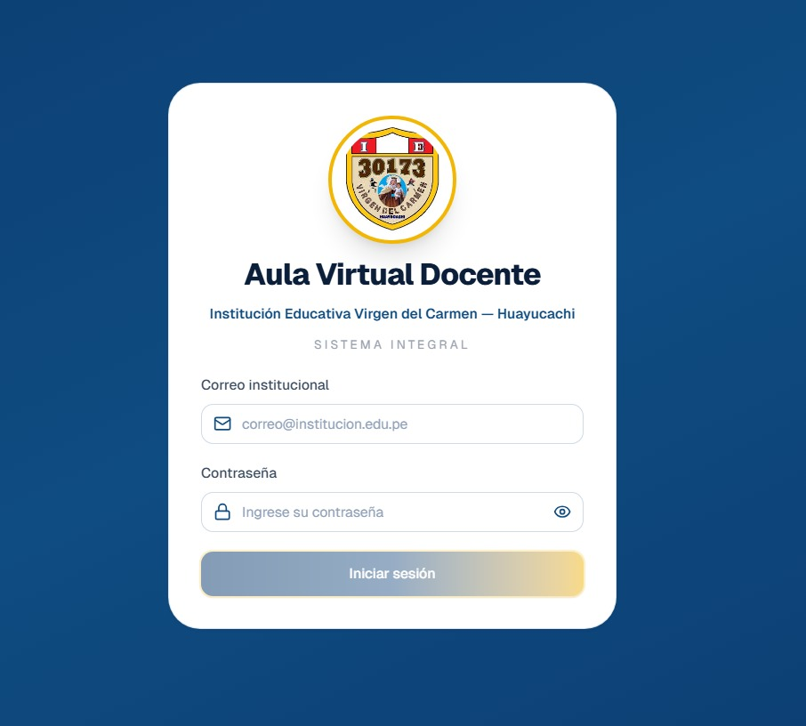
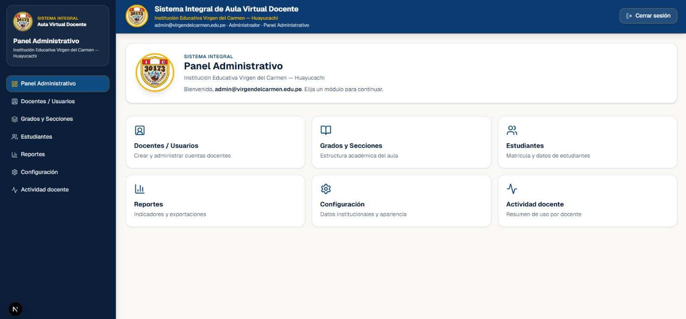
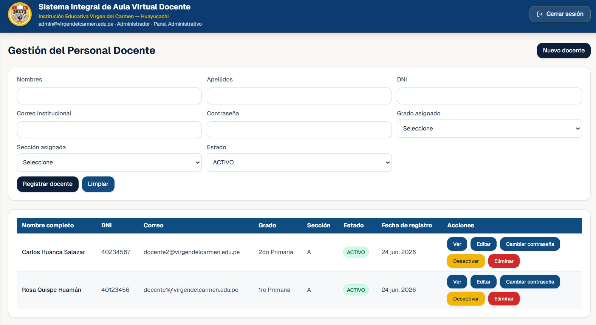
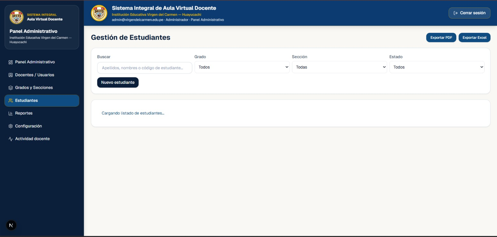
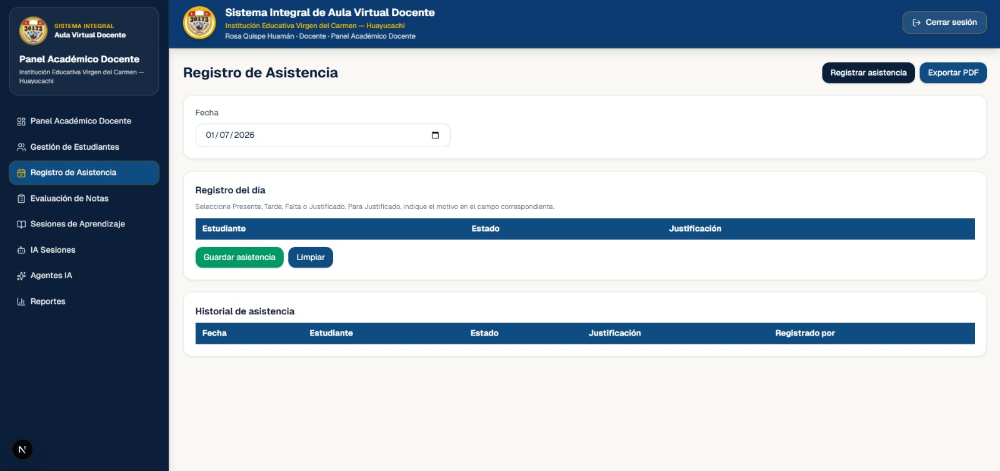
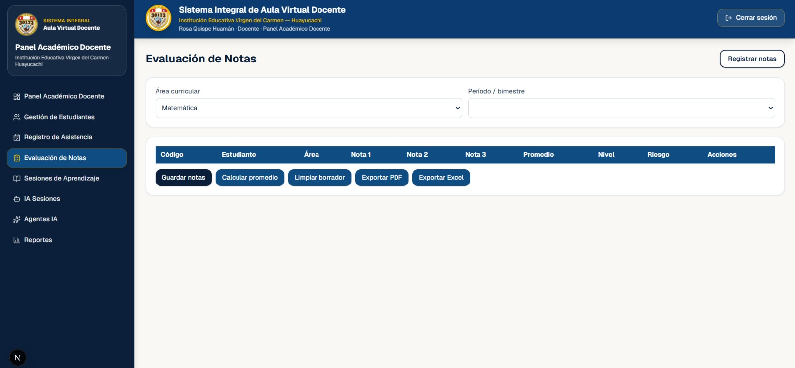
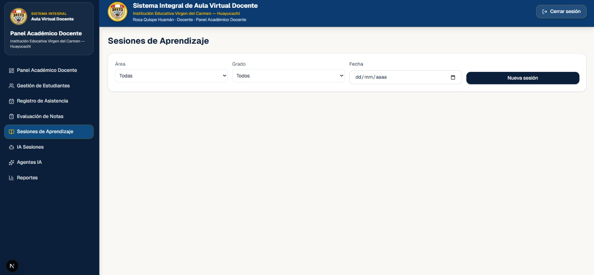
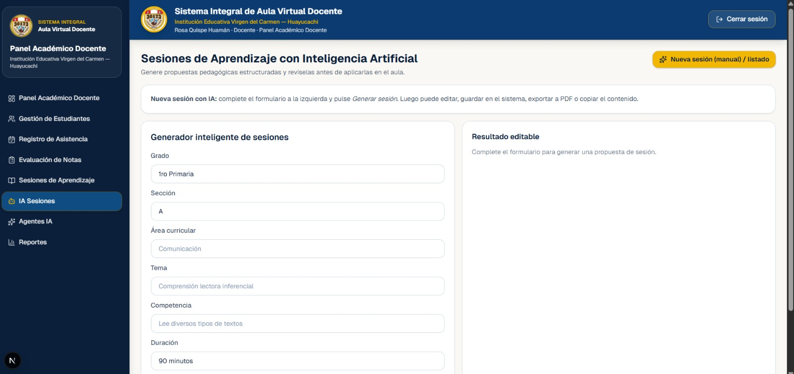
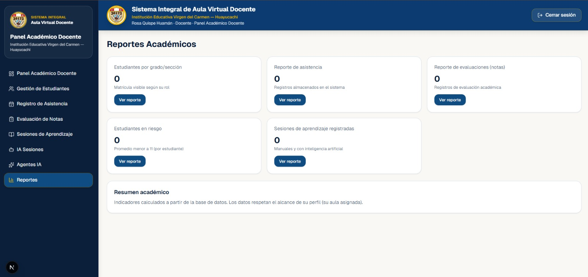
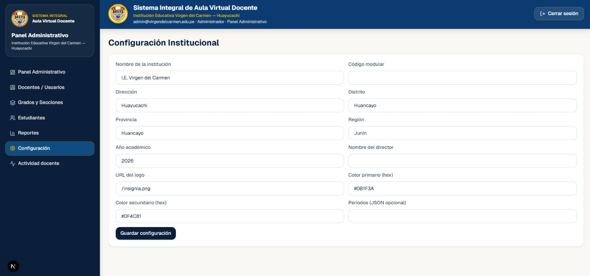

# Mockups del Sistema

## Pantalla Login

Descripción

Permite el acceso seguro al sistema.

---

## Dashboard

Descripción

Presenta indicadores generales.

---

## Docentes

Descripción

Permite administrar docentes.

---

## Estudiantes

Descripción

Permite administrar estudiantes.

---

## Grados y Secciones

Descripción

Administra grados y secciones.

---

## Asistencia

Descripción

Registro de asistencia.

---

## Notas

Descripción

Registro de calificaciones.

---

## Sesiones

Descripción

Gestión de sesiones.

---

## IA Sesiones

Descripción

Generación automática mediante IA.

---

## Reportes

Descripción

Generación de reportes.

---

## Configuración

Descripción

Configuración general.